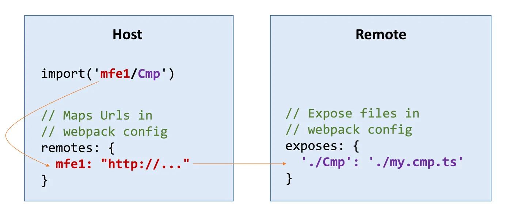

Los sistemas de software a escala empresarial suelen ser implementados por varios equipos multifuncionales. Para permitir que dichos equipos proporcionen nuevas funcionalidades de manera eficiente, es deseable minimizar la necesidad de coordinación entre ellos. Esto requiere una modularización que verticalice el sistema en áreas de bajo acoplamiento de las que los equipos individuales puedan encargarse.

Existen varias posibilidades para implementar dichos módulos de alto nivel (también llamados verticales). Por ejemplo, pueden implementarse utilizando una estructura de carpetas respectiva o en forma de varias bibliotecas en un Monorepo. Los Micro Frontends van un paso más allá y designan una aplicación separada para cada vertical. Este estilo arquitectónico promete varias ventajas, como una gran autonomía del equipo, pero también conlleva numerosos desafíos.

La primera parte de este artículo ofrece una visión general crítica de los beneficios y desventajas de los Micro Frontends en el ámbito de las aplicaciones de página única. La segunda parte discute cómo se puede implementar dicha arquitectura con Native Federation, un proyecto comunitario construido sobre estándares web que proporciona una estrecha integración con la CLI de Angular.

# Motivación Detrás de los Micro Frontends

Al igual que los Microservicios, los Micro Frontends prometen varias ventajas, tanto técnicas como con respecto a la organización. Dado que aplicar arquitecturas de Micro Frontends resulta en varias aplicaciones más pequeñas, probar, ajustar el rendimiento y aislar fallos en una parte del sistema general se vuelve más sencillo, según varias fuentes.

Sin embargo, el aumento de la autonomía del equipo fue la razón principal para aplicar este estilo arquitectónico en los numerosos casos en los que participé como consultor. Los equipos individuales no se ven bloqueados por la espera de otros equipos y pueden desplegarse por separado en cualquier momento. Esto podría no ser una preocupación significativa en una gran cantidad de proyectos. Aun así, tan pronto como hablamos de proyectos multi-equipo en un entorno corporativo con largos caminos de comunicación y tiempos de decisión, este aspecto se vuelve vital rápidamente para el éxito del proyecto.

Los equipos también pueden tomar sus propias decisiones que mejor se adapten a sus objetivos, tanto arquitectónica como tecnológicamente. ==Mezclar múltiples frameworks del lado del cliente en la misma aplicación se considera un antipatrón y debe evitarse.== Sin embargo, puede ayudar a crear una ruta de migración hacia una nueva pila tecnológica a largo plazo. La preocupación en los entornos corporativos es que encontramos soluciones de software que generalmente sobreviven al ciclo de vida promedio de la pila tecnológica.

Dado que los Micro Frontends resultan en procesos de compilación separados, combinarlos con compilaciones incrementales, donde solo las aplicaciones modificadas necesitan ser recompiladas, tiene un potencial masivo para mejorar los tiempos de compilación. Por ejemplo, el conocido [sistema de compilación Nx](https://nx.dev/) ofrece esta opción. Curiosamente, esta característica también se puede utilizar sin aplicar otros aspectos como alinear equipos con aplicaciones individuales o despliegues separados. Existe un debate sobre si aprovechar esta tentadora opción conduce automáticamente a arquitecturas de micro frontend.

Un sistema que consta de varias aplicaciones más pequeñas puede proporcionar ventajas organizativas adicionales: Es más fácil incorporar nuevos miembros y escalar el desarrollo añadiendo más micro frontends. La autonomía del equipo también conduce a ciclos de lanzamiento más rápidos.

# Desafíos a tener en cuenta

Toda decisión arquitectónica tiene consecuencias que deben evaluarse, y los Micro Frontends no son una excepción. Además de las consecuencias positivas descritas anteriormente, también hay varias negativas a considerar.

Por ejemplo, los Micro Frontends desarrollados individualmente pueden divergir en UI/UX, lo que lleva a una apariencia inconsistente. Además, cargar varias aplicaciones aumenta el número de paquetes que deben descargarse, lo que afecta negativamente los tiempos de carga y aumenta la presión sobre la memoria.

Dividir una aplicación en partes de bajo acoplamiento podría ser una buena práctica en general. Sin embargo, a menudo es difícil definir los límites entre verticales con la suficiente claridad como para implementarlos como aplicaciones individuales. Además, si bien tener varias aplicaciones pequeñas a primera vista simplifica la implementación, integrarlas en una solución general conlleva una complejidad adicional.

Esto nos lleva a uno de los mayores desafíos que he visto en la práctica: nos estamos alejando de una integración en tiempo de compilación hacia una integración en tiempo de ejecución. Esto tiene graves consecuencias porque no podemos prever fácilmente los problemas que podrían surgir cuando las aplicaciones desarrolladas y desplegadas individualmente comiencen a interactuar en tiempo de ejecución. Además de la posibilidad de conflictos técnicos, también tenemos que ver que la generación actual de frameworks SPA no ha sido construida con tal modo de operación en mente.

En cambio, los frameworks SPA modernos, especialmente Angular, se han desarrollado para centrarse en las optimizaciones en tiempo de compilación. Un compilador potente aprovecha las comprobaciones de tipo para identificar conflictos técnicos y emite código fuente eficiente optimizado para el _tree-shaking_. Además, la CLI en el espacio de Angular proporciona un proceso de compilación altamente optimizado. Un uso no previsto, necesario para implementar Micro Frontends, socava algunos de estos logros.

# Angular No Soporta Oficialmente los Micro Frontends

Por todas las razones expuestas, el equipo de Angular recomienda verificar si alternativas, como implementar las verticales individuales en Monorepos, que pueden compilarse juntas, son adecuadas. Por ejemplo, Google adoptó este enfoque hace años y gestiona todos sus productos y bibliotecas en un [único Monorepo](https://dl.acm.org/doi/10.1145/2854146).

Por supuesto, también hay formas de compensar las desventajas aquí descritas, y algunas de ellas, como establecer un sistema de diseño para ayudar con una UI/UX consistente o la carga diferida de partes individuales del sistema, podrían ser necesarias en general. Se pueden encontrar más detalles sobre tales estrategias de compensación en esta [encuesta](https://www.angulararchitects.io/blog/consequences-of-micro-frontends-survey-results) a más de 150 profesionales de Micro Frontends.

Todas las decisiones arquitectónicas tienen beneficios e inconvenientes y deben evaluarse con esas consideraciones si se va a implementar una solución. Si tal evaluación revela que los Micro Frontends proporcionan más ventajas que las alternativas para alcanzar sus objetivos específicos, las siguientes secciones le proporcionan un camino bien iluminado para implementar este patrón arquitectónico con Angular.

# Micro Frontends con Federation

[Module Federation](https://module-federation.io/) es una tecnología popular para implementar Micro Frontends y compartir dependencias. Enviada inicialmente con webpack 5, viene con un tiempo de ejecución agnóstico a las herramientas y proporciona integración en tiempo de compilación en _rspack, rebuild,_ y _vite_. Además del uso del servidor de desarrollo de vite, estas tecnologías actualmente no son compatibles con la CLI de Angular. Sin embargo, soluciones comunitarias prometedoras como [_@ng-rsbuild/plugin-nx_](https://angular-rspack.dev/) y [AnalogJS](https://analogjs.org/) permiten su uso con Angular. [Nx](https://nx.dev/) y mi [plugin CLI](https://www.npmjs.com/package/@angular-architects/module-federation) proporcionan una integración sin esfuerzo.

Module Federation permite que una aplicación cargue de forma diferida partes de otras aplicaciones construidas y desplegadas por separado. La aplicación que carga se conoce como _host_; las integradas se llaman _remotes_:



Federation, si lo permite la versión de la biblioteca, puede compartir dependencias como Angular o RxJS entre el _host_ y los _remotes_. Existen varias opciones de configuración para [prevenir desajustes de versión](https://www.angulararchitects.io/blog/getting-out-of-version-mismatch-hell-with-module-federation/). Dado que MF solo puede decidir qué dependencias compartir en tiempo de ejecución, el _tree-shaking_ para las partes compartidas no es posible.

Para informar al _host_ sobre los _remotes_ y sus dependencias compartidas, Module Federation crea un archivo de metadatos, el llamado _remote entry_, durante la compilación. Este archivo necesita ser cargado en el _host_.

# Native Federation

Para desacoplar completamente la idea de Federation de empaquetadores específicos, comencé el proyecto [Native Federation](https://www.npmjs.com/package/@angular-architects/native-federation) hace varios años. Su superficie API es muy similar a la de Module Federation. El enfoque está en la portabilidad y estándares como los módulos ECMAScript y los Mapas de Importación. Su tiempo de compilación actúa como un envoltorio alrededor de los empaquetadores existentes. Para la comunicación con el empaquetador, utiliza un adaptador intercambiable:


La integración en la CLI de Angular delega directamente al _ApplicationBuilder_ de Angular que aprovecha el rápido empaquetador esbuild, y es la base de varias características actuales como la hidratación parcial. Debido a su arquitectura, Native Federation también puede portarse a otros empaquetadores o a otras innovaciones que la CLI pueda proporcionar a largo plazo.

Para integrar Micro Frontends construidos con el empaquetador basado en webpack de Angular, existe una [solución puente](https://www.angulararchitects.io/blog/combining-native-federation-and-module-federation/) que permite la carga de dichos _remotes_ en un _host_ de Native Federation. Esta solución permite la adopción gradual del nuevo _ApplicationBuilder_ de la CLI y permite compartir dependencias entre los dos tipos de Federation. Una de las características añadidas recientemente es el soporte para [SSR e Hidratación](https://www.angulararchitects.io/blog/ssr-and-hydration-with-native-federation-for-angular/), que es vital para aplicaciones críticas de rendimiento como portales públicos y tiendas web.

Native Federation para Angular está cerca del _ApplicationBuilder_ de la CLI, pero su modo de compilación para dependencias compartidas difiere. Si bien funciona bien para paquetes que se alinean con el [Formato de Paquete de Angular](https://angular.dev/tools/libraries/angular-package-format), que es el caso de todas las bibliotecas construidas con la CLI, otras bibliotecas podrían presentar algunos desafíos, especialmente las más antiguas que todavía usan CommonJS o convenciones más antiguas para proporcionar metadatos.

# Usando Native Federation en Angular

Para la configuración, Native Federation proporciona un _schematic_:

```sh
ng add @angular-architects/native-federation --project mfe1 --port 4201 --type remote
```

El modificador _type_ define el tipo de aplicación. Las opciones posibles son _remote_, _host_ y _dynamic-host_. Este último es un _host_ configurado con un archivo de configuración (manifiesto de federación) durante el inicio de la aplicación. Este manifiesto informa a la aplicación de las ubicaciones de los _remotes_ y puede ser reemplazado por otro manifiesto durante el despliegue:

```json
{
  "mfe1": "http://localhost:4201/remoteEntry.json"
}
```

La clave, en este caso _mfe1_, es un nombre corto que el _host_ utiliza para referirse al Micro Frontend. El valor es la ubicación del _remote entry_ con los metadatos mencionados anteriormente. Alternativamente, el manifiesto puede ser reemplazado por un servicio que informa al _host_ de la ubicación actual de todos los _remotes_ desplegados y actúa como un registro de Micro Frontend.

El _schematic_ configura la delegación del constructor de Native Federation al _ApplicationBuilder_ y crea un archivo de configuración _federation.config.js_:

```ts
const {
  withNativeFederation,
  shareAll,
} = require("@angular-architects/native-federation/config");

module.exports = withNativeFederation({
  name: "mfe1",

  exposes: {
    "./Component": "./projects/mfe1/src/app/app.component.ts",
  },

  shared: {
    ...shareAll({}),
  },

  skip: [
    "rxjs/ajax",
    "rxjs/fetch",
    "rxjs/testing",
    "rxjs/webSocket",
    // Añade otros paquetes que no necesites en tiempo de ejecución
  ],
});
```

La configuración asigna un nombre único al _remote_ o _host_ y define qué dependencias compartir. En lugar de proporcionar una lista exhaustiva de todas las dependencias a compartir, la configuración utiliza la función auxiliar _shareAll_, que añade todas las dependencias encontradas en el _package.json_ del proyecto. La lista _skip_ se utiliza para optar por no compartir algunas de ellas o sus puntos de entrada secundarios.

Los _remotes_ también definen módulos EcmaScript expuestos que pueden cargarse en el _shell_. Para esto, el nodo _exposed_ mapea las rutas de los módulos a nombres cortos como _./Component_ en el ejemplo mostrado.

El _schematic_ también añade código para inicializar Native Federation al _main.ts_. Para el _host_, este código apunta al manifiesto de federación:

```ts
import { initFederation } from "@angular-architects/native-federation";

initFederation("federation.manifest.json")
  .catch((err) => console.error(err))
  .then((_) => import("./bootstrap"))
  .catch((err) => console.error(err));
```

Después de inicializar la federación, se carga el archivo _bootstrap.ts_, también creado por el _schematic_. Contiene el código usual para arrancar Angular, por ejemplo, mediante _bootstrapApplication_ cuando la aplicación utiliza Componentes Autónomos (_Standalone Components_).

Para cargar un componente o una configuración de enrutamiento expuesta por un _remote_, la carga diferida tradicional se combina con la función _loadRemoteModule_ de Native Federation:

```ts
import { loadRemoteModule } from '@angular-architects/native-federation';

export const APP_ROUTES: Routes = [
  [...]

  {
    path: 'flights',
    loadChildren: () =>
      loadRemoteModule('mfe1', './Component').then((m) => m.AppComponent),
  },

  [...]
];
```

Aquí, _mfe1_ es la clave definida en el manifiesto, y _./Component_ apunta al respectivo módulo expuesto en la configuración de federación del _remote_.

Se puede encontrar más información sobre Native Federation en este [artículo de blog](https://www.angulararchitects.io/blog/micro-frontends-with-modern-angular-part-1-standalone-and-esbuild/) y en el [readme del proyecto](https://www.npmjs.com/package/@angular-architects/native-federation), que también enlaza a un tutorial.

# Conclusión

Los Micro Frontends prometen ventajas significativas para aplicaciones a escala empresarial, como una mayor autonomía del equipo y despliegue independiente. Estos beneficios hacen que este estilo arquitectónico sea particularmente atractivo en entornos corporativos multi-equipo donde la comunicación optimizada y los ciclos de desarrollo rápidos son críticos. Adicionalmente, soportan la migración gradual a nuevas tecnologías y optimizan los tiempos de compilación aprovechando las compilaciones incrementales.

Sin embargo, estas ventajas vienen con concesiones. Los Micro Frontends pueden llevar a una UI/UX inconsistente, tiempos de carga aumentados e integraciones complejas en tiempo de ejecución. Definir límites verticales claros y gestionar la comunicación entre aplicaciones añade un desafío. Además, frameworks como Angular, diseñados para la optimización en tiempo de compilación, enfrentan limitaciones en escenarios de integración en tiempo de ejecución. Por lo tanto, el equipo de Angular recomienda alternativas como dividir una aplicación en bibliotecas gestionadas dentro de un Monorepo, lo cual se alinea mejor con las fortalezas de Angular en seguridad de tipos y compilación eficiente.

Module Federation ha surgido como una solución popular para abordar algunos desafíos al permitir la carga diferida y el intercambio de dependencias. Native Federation se basa en estos conceptos con un enfoque en estándares y portabilidad. Proporciona una integración fluida en la CLI de Angular y su eficiente _ApplicationBuilder_ basado en esbuild, que también es la base para características avanzadas como SSR e hidratación.

_Junto con su equipo en_ [_ANGULARarchitects.io_](http://www.angulararchitects.io/), _Manfred Steyer ayuda a empresas de todo el mundo a establecer arquitecturas mantenibles basadas en Angular. Es formador, consultor y Google Developer Expert (GDE) y escribe para O’Reilly, la revista alemana Java Magazin, windows.developer y Heise Developer. Además, interviene regularmente en conferencias._

- [Artículo original](https://blog.angular.dev/micro-frontends-with-angular-and-native-federation-7623cfc5f413)
